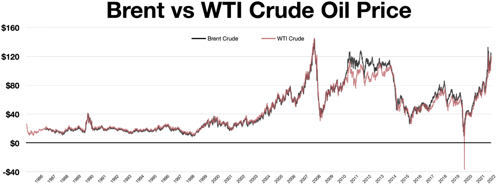

## Oil Market Overview and Choice of Brent Crude Oil

Oil has been one of the most important global energy resources for over a century. It is crucial for transportation, industry, and energy production, and plays a significant role in the global economy and geopolitics. Oil price fluctuations impact stock indices, corporate bonds, and risk management strategies, making it a key financial asset for investors, companies, and governments.

### The Brent Crude Oil Benchmark

Among different types of crude oil, Brent Crude Oil is the main international benchmark due to its high quality, widespread use in European and global markets, and liquidity on trading platforms such as the London Intercontinental Exchange (ICE). Brent represents roughly two-thirds of globally traded oil and serves as a reference for pricing and hedging strategies.

Compared to other benchmarks like West Texas Intermediate (WTI), Brent is slightly heavier and has a higher sulfur content, making it suitable for refining into high-quality fuels. Its global importance and market stability make it an ideal reference asset for financial analysis.

### Market Volatility and Extreme Events

The Brent market is characterized by high volatility and exposure to extreme events, which can challenge traditional risk models. Notable examples include:

- The 2008 global financial crisis, which caused oil prices to drop sharply;

- Geopolitical shocks and price wars, such as the Saudi-Russia conflict in 2020;

- The unprecedented negative WTI prices in April 2020 due to COVID-19 and storage constraints.

These extreme events highlight the importance of advanced risk modeling to capture the tails of the return distribution and accurately estimate potential losses. That's why Brent Crude Oil is an ideal case study for Value at Risk (VaR) analysis, particularly for testing machine learning models. Its price dynamics, influenced by geopolitical, economic, and speculative factors, allow for the evaluation of predictive models under conditions of elevated uncertainty and extreme market movements.
