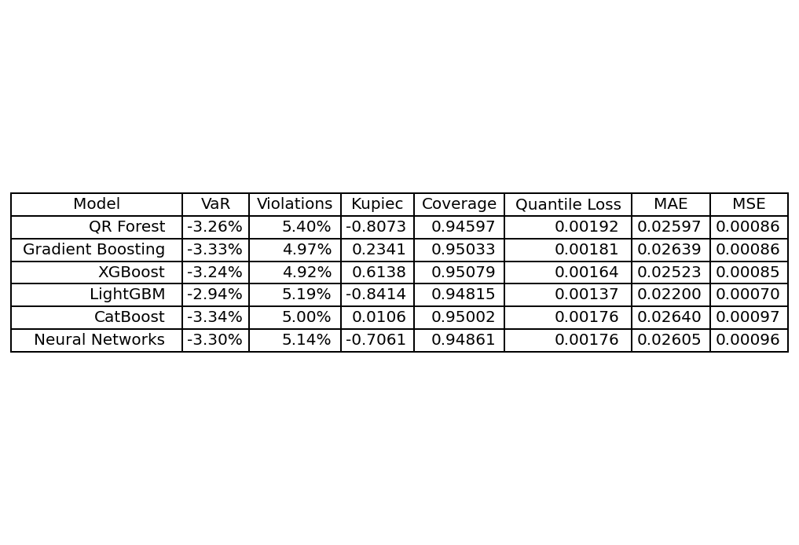
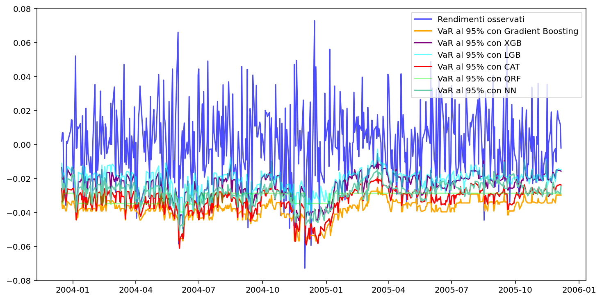
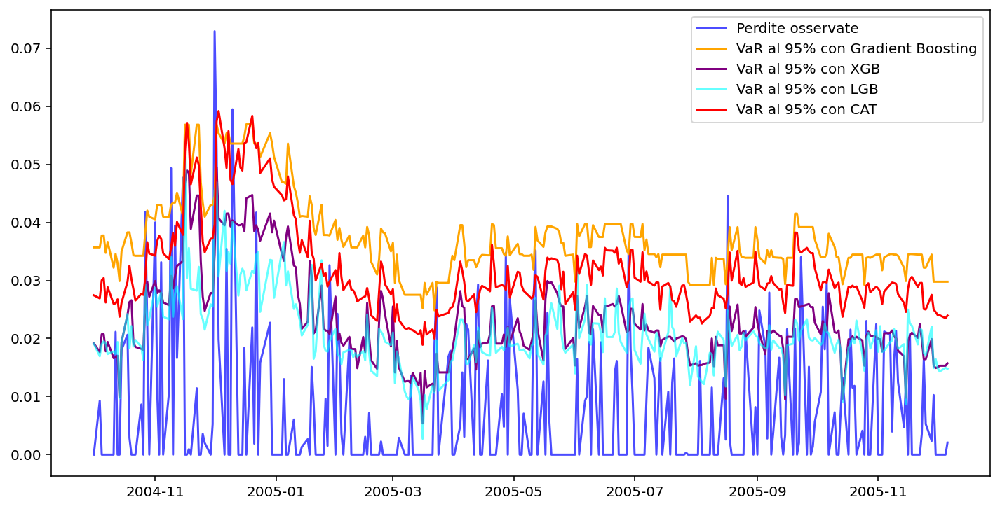

##Machine Learning VaR Backtesting Results

This folder contains the results of backtesting for six different machine learning models used to estimate Value at Risk (VaR) for Brent Crude Oil. The models analyzed are:
- Quantile Regression Forest (QRF)

- Gradient Boosting (GB)

- XGBoost (XGB)

- LightGBM (LGB)

- CatBoost (CAT)

- Neural Networks (NN)

The evaluation of these models is based on multiple metrics, including the number of VaR violations, the Kupiec test, coverage, quantile loss, Mean Absolute Error (MAE), and Mean Squared Error (MSE). These metrics assess the models both in terms of calibration and the accuracy of the VaR estimates.

###Calibration Analysis

- Number of Violations: Indicates how often the observed loss exceeded the predicted VaR. Values too high or too low suggest underestimation or overestimation of risk.

- Kupiec Test: Assesses the statistical significance of the violations.

- Coverage: Measures the proportion of data points actually covered by the chosen confidence level.

Results show that CatBoost provides the most reliable calibration, with violations very close to the expected 5% and a Kupiec test value near zero (0.0106). Gradient Boosting and XGBoost also demonstrate good coverage (violations of 4.97% and 4.92%, respectively). LightGBM shows slightly higher violations (5.19%) and a negative Kupiec test value, indicating lower reliability in calibration.

Accuracy Analysis

The precision of predictions is evaluated using quantile loss, MAE, and MSE:

LightGBM achieves the lowest quantile loss (0.00137), MAE (0.02200), and MSE (0.00070), making it the most accurate model in terms of VaR prediction.

XGBoost, CatBoost, and Neural Networks perform competitively, with slightly higher MAE and MSE values.

Overall Performance

The choice of the “best” model depends on the evaluation criterion:

Calibration-focused: CatBoost is preferable due to its excellent alignment with expected violations and low Kupiec test value.

Accuracy-focused: LightGBM is the most precise based on quantile loss, MAE, and MSE.

All boosting models (Gradient Boosting, XGBoost, LightGBM, CatBoost) provide a strong balance between calibration and accuracy, outperforming both Quantile Regression Forest and Neural Networks. Their ability to capture complex data relationships and flexibility in optimization make them particularly effective for VaR estimation.

###Visualizations

- VaR Comparison Across All ML Models (2 Years of Returns):

- VaR Comparison for Boosting Models (1 Year of Losses):

These figures illustrate the performance of each model in estimating VaR, showing both calibration and precision relative to actual losses and returns.
