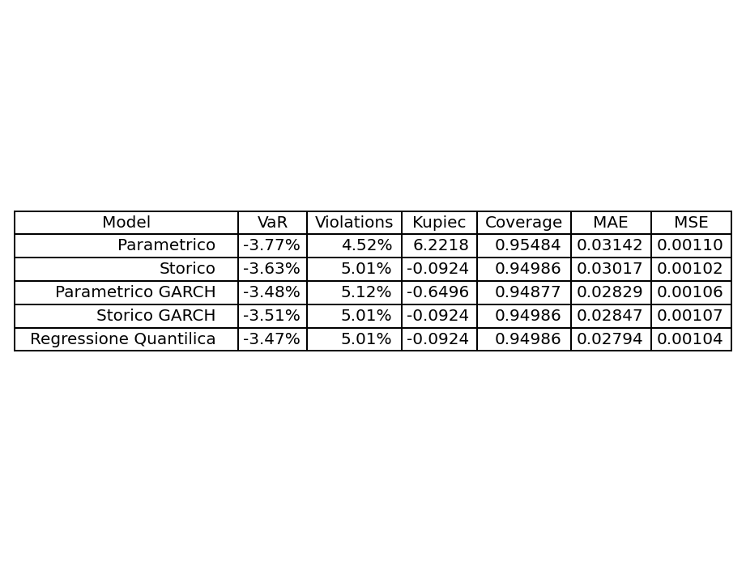

# Traditional VaR Backtesting

The backtesting analysis evaluates the performance of each model in terms of calibration and accuracy, using metrics such as the number of violations, Kupiec test statistic, coverage, Mean Absolute Error (MAE), and Mean Squared Error (MSE).

## Models Included

1. **Parametric VaR**  
   - Assumes normally distributed returns.  
   - Most conservative model with a VaR of -3.77%.  
   - Violations: 4.52% (slightly below the expected 5%).  
   - Kupiec Test Statistic: 6.2218 (p-value < 0.05, not significant).  
   - Coverage: 95.48%.  
   - MAE / MSE: 0.03142 / 0.00110.  
   - Provides stability but may overestimate the capital requirement.

2. **Historical VaR**  
   - Non-parametric, based entirely on historical data.  
   - VaR: -3.63%, slightly less conservative than parametric.  
   - Violations: 5.01%, well-aligned with the confidence level.  
   - Kupiec Test Statistic: -0.0924 (indicates good calibration).  
   - Coverage: 94.99%.  
   - MAE / MSE: 0.03017 / 0.00102.  
   - Offers accurate data-driven estimates but may react slowly to structural changes.

3. **Parametric VaR with GARCH Volatility**  
   - Incorporates conditional volatility via GARCH model.  
   - VaR: -3.48%, less conservative than standard parametric.  
   - Violations: 5.12%.  
   - Kupiec Test Statistic: -0.6496 (slight underestimation of risk).  
   - Coverage: 94.88%.  
   - MAE / MSE: 0.02829 / 0.00106.  
   - Improves accuracy compared to standard parametric VaR.

4. **Historical VaR with GARCH Volatility**  
   - Similar to Historical VaR with slightly better precision.  
   - VaR: -3.51%.  
   - Violations: 5.01%.  
   - Kupiec Test Statistic: -0.0924.  
   - Coverage: 94.99%.  
   - MAE / MSE: 0.02847 / 0.00107.

5. **Quantile Regression (QR)**  
   - VaR: -3.47%, very close to historical/GARCH models.  
   - Violations: 5.01%, perfectly aligned with theoretical threshold.  
   - Kupiec Test Statistic: -0.0924 (excellent calibration).  
   - Coverage: 94.99%.  
   - MAE / MSE: 0.02794 / 0.00104.  
   - Combines solid calibration with high precision, outperforming other classical methods.

## Summary

Comparing the models based on calibration metrics, the Historical VaR, Historical GARCH VaR, and Quantile Regression show the best performance, with violations very close to the expected level and no significant issues flagged by the Kupiec test. In terms of precision, Quantile Regression leads with the lowest MAE and MSE, followed by Parametric GARCH and Historical GARCH. Overall, Quantile Regression proves to be the most effective model, combining robust calibration with superior VaR estimation accuracy.
