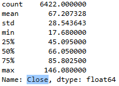
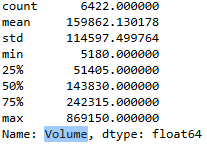
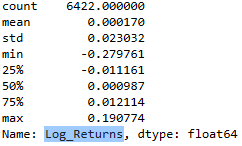
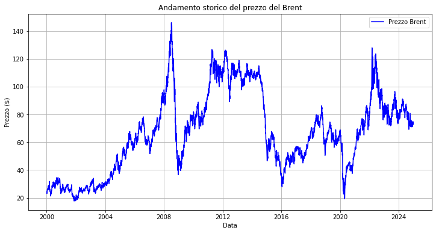
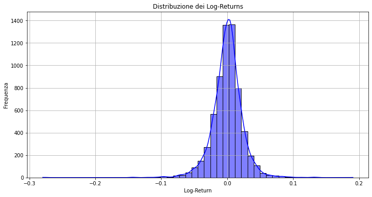
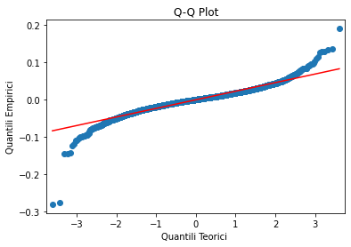
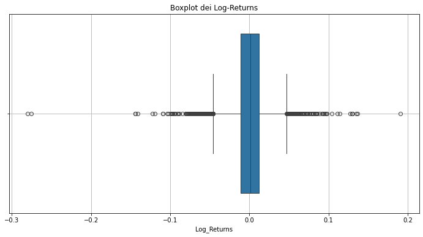
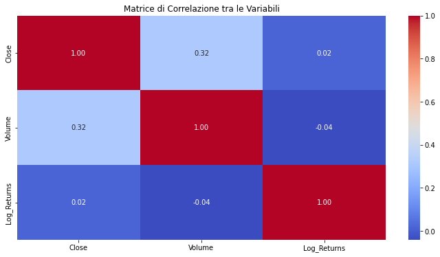

# Exploratory Data Analysis (EDA)

This section provides an overview of the exploratory analysis performed on the Brent crude oil dataset. The goal of the EDA is to understand the statistical properties of the variables, detect extreme events, and identify potential challenges for risk modeling.

## 1. Descriptive Statistics
Using the `.describe()` function from **pandas**, we obtained summary statistics of the key variables:
- **Close**: mean = 67.21, std = 28.54, range = [17.68, 146.08].
- 
- **Volume**: mean = 159,862, std = 114,597, range = [5,180, 869,150].
- 
- **Log Returns**: mean ≈ 0.00017, std = 0.023, range = [-0.28, 0.19].
- 

This highlights significant variability in oil prices and occasional spikes in volatility.

## 2. Historical Price Trends
The time series of Brent prices shows several critical events:
- Peak above $140 in 2008, followed by a sharp drop during the global financial crisis.
- Stable period above $100 between 2011–2014, then a crash below $30 in 2016 (OPEC decisions).
- Collapse in 2020 during the COVID-19 pandemic, followed by a recovery in 2021–2022.
-  
These events reflect the cyclical and volatile nature of the oil market, crucial for Value-at-Risk (VaR) estimation.

## 3. Distribution of Returns
- **Histogram & Distribution Shape**: returns are negatively skewed (skewness = -0.62) and leptokurtic (kurtosis = 10.48).
- This implies heavier tails and higher probability of extreme negative returns compared to a normal distribution.
- 

## 4. Normality Tests
- A **Q-Q plot** shows clear deviations from normality, especially in the tails.
-   
- The **Kolmogorov–Smirnov test** rejects the null hypothesis of normality (stat = 0.46706, p-value = 0.0).  
- This indicates that normality-based models might underestimate risk in presence of extreme events.

## 5. Extreme Events
-  
A **boxplot of log-returns** reveals several outliers, especially during:
- The 2008 financial crisis,
- The 2014–2016 oil price collapse,
- The 2020 COVID-19 crisis.

Outliers confirm the non-normal nature of returns and highlight the importance of tail-sensitive risk models.

## 6. Correlation Analysis
 
- **Close vs. Volume**: moderate positive correlation (0.317).
- **Close vs. Log Returns**: negligible correlation (0.017).
- **Volume vs. Log Returns**: very weak negative correlation (-0.041).

Highly correlated price variables (Open, High, Low) were excluded to avoid redundancy, as they carry similar information to the Close price.

---

### Key Insights
- Oil prices are highly volatile and affected by macroeconomic and geopolitical shocks.
- Returns show **fat tails** and **negative skewness**, challenging the assumption of normality.
- Extreme events play a critical role in risk management and must be captured by more advanced models (e.g., GARCH, ML-based approaches).

